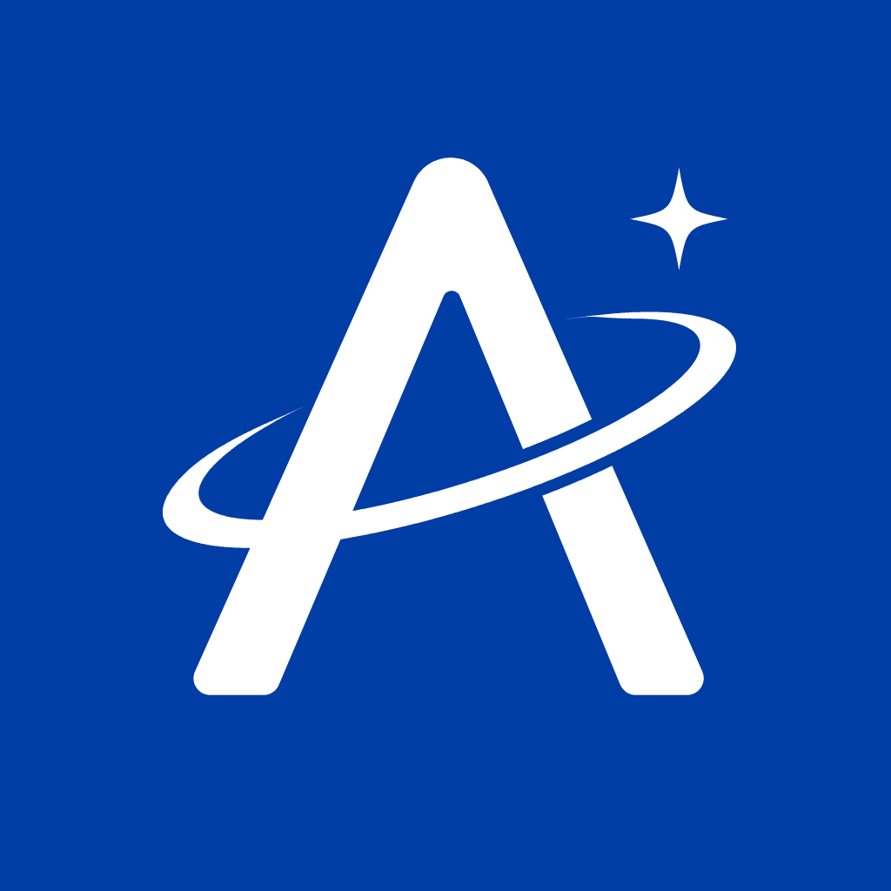

<div align="center">



# Aureways

**面向 agentic coding 的 macOS 原生客户端。** 用 SwiftUI 写成的 `.app`——不是网页，也不是套壳。选定工作区，在系统窗口里对话、改文件、开终端，让 agent 干活。

[](https://github.com/nullskymc/Aureways/actions/workflows/release.yml)
[](LICENSE)

[English](README.md) · [文档目录](docs/README.md)

</div>

它实现 [Agent Client Protocol](https://agentclientprotocol.com)，在同一进程里把本机命令行 Agent 作为子进程拉起，走 stdio NDJSON。没有远程后端，也没有单独的 HTTP 服务——客户端直接驱动 agent。

## 能做什么

- **原生 Mac 界面**：统一工具栏、侧栏、系统偏好设置（`⌘,`）、浅色 / 深色跟随系统（可在偏好设置里覆盖）；文件在 Finder 中显示，终端是本机 PTY。
- **任意 ACP Agent**：内置七家常见命令行 Agent，也可以在偏好设置里添加任意启动命令。会话按工作区列在侧栏，Agent 支持时可跨启动恢复。
- **流式对话**：Markdown 正文、可展开的思考、分组的工具调用、计划步骤。输入框支持 `/` 命令、`@` 引用工作区文件，以及图片和文件附件。超长转录已虚拟化，滚动成本只跟可见内容成正比。
- **权限**：Agent 读写文件、执行命令前先征求确认；也可以改成由客户端代为批准。
- **右侧工作台**（`⌘B`）：文件浏览器、文本编辑器（行号、`⌘S`、与 Agent 同时改文件时的冲突处理）、交互终端。每个打开的文件和终端各占一个标签，来回切换不丢状态。

```
┌──────────────┬────────────────────────────────────────────┬──────────────┐
│ 侧栏          │  统一工具栏：工作区 · 会话状态 · 搜索        │ 工作台 ⌘B     │
│  • 新对话 ⌘N  │                                            │  • 文件浏览器  │
│  • 工作区      ├────────────────────────────────────────────┤  • 文本编辑器  │
│    会话 ⌘1…⌘9│  对话流（居中，流式）                       │  • 交互终端    │
│               │  用户气泡 · Agent 正文 · 思考 · 工具卡片    │  • 会话信息    │
│               │  · 计划步骤                                │               │
│               ├────────────────────────────────────────────┤               │
│               │  悬浮输入框（⌘Return 发送）                │               │
└──────────────┴────────────────────────────────────────────┴──────────────┘
```

## 内置 Agent

| 名称 | 启动命令 |
| --- | --- |
| Grok Build | `grok agent stdio` |
| Codex | `npx -y @agentclientprotocol/codex-acp` |
| Claude Code | `npx -y @agentclientprotocol/claude-agent-acp` |
| Antigravity | `agy --acp`（找不到时回退 `npx -y agy-acp`） |
| GitHub Copilot | `copilot --acp --stdio` |
| Cursor Agent | `cursor-agent acp` |
| OpenCode | `opencode acp` |

对应命令行需事先安装并完成登录。登录和密钥由各 Agent 自己的 CLI 管理，不进 Aureways 的设置。自定义 Agent 在偏好设置（`⌘,`）里添加。

## 运行

**安装**——从 [Releases](https://github.com/nullskymc/Aureways/releases) 下载 `.dmg`，把 `Aureways.app` 拖进 `Applications`。产物是 ad-hoc 签名、未经公证；首次启动若被 Gatekeeper 拦截：

```bash
xattr -dr com.apple.quarantine /Applications/Aureways.app
```

**源码编译**——要求 macOS 26+、Xcode 26+（本仓库用 Xcode 27 开发）。应用未开启 App Sandbox。在**仓库根目录**操作（能看到 `Makefile` 和 `Aureways.xcodeproj` 的那一层，不是内层 `Aureways/` 源码目录）：

```bash
make open
```

或打开工程后，在 Xcode 里选 scheme **Aureways**、目的地 **My Mac**，按 `⌘R`：

```bash
open Aureways.xcodeproj
```

默认使用当前 `xcode-select` 工具链。若要用某个 Xcode.app：

```bash
make open DEVELOPER_DIR=/Applications/Xcode-beta.app/Contents/Developer
```

| 命令 | 作用 |
| --- | --- |
| `make build` | Debug 编译 |
| `make open` | 编译并打开 `.app` |
| `make test` | 跑 `AurewaysTests` |
| `make release` | Release 构建（发版用） |
| `make clean` | 删除 `.derived` |

首次命令行构建若提示缺少 Metal 工具链：

```bash
xcodebuild -downloadComponent MetalToolchain
```

## 快捷键

| 按键 | 作用 |
| --- | --- |
| `⌘N` | 新对话 |
| `⌘1` … `⌘9` | 选择会话 |
| `⌘B` / `⌥⌘I` | 展开 / 折叠工作台 |
| `⌘,` | 偏好设置 |
| `⌘Return` | 发送消息 |
| `⌘.` | 停止生成 |
| 输入框 `/` | Slash 命令 |
| 输入框 `@` | 引用工作区文件 |

## 文档

| 文档 | 内容 |
| --- | --- |
| [文档目录](docs/README.md) | 索引与阅读顺序 |
| [目录结构](docs/directory.md) | 仓库与源码树 |
| [架构](docs/architecture.md) | 前后端职责、会话与持久化 |
| [前端](docs/frontend.md) | SwiftUI 界面与状态 |
| [后端](docs/backend.md) | 连接、进程、文件系统、终端 |
| [协议](docs/protocol.md) | 已实现的 ACP 方法 |
| [开发与运行](docs/development.md) | 工具链、测试、调试连接失败 |

## 发版

约定：**只有打 tag 才触发构建**，分支与 PR 不跑 CI。工作流见 [`.github/workflows/release.yml`](.github/workflows/release.yml)。

```bash
git tag v0.2.0
git push origin v0.2.0
```

流程：`make test` → Release 构建 → 打包 `Aureways-<tag>.dmg` → 创建 GitHub Release 并附带产物。

## License

MIT。见 [LICENSE](LICENSE)。
