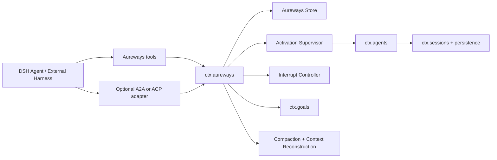
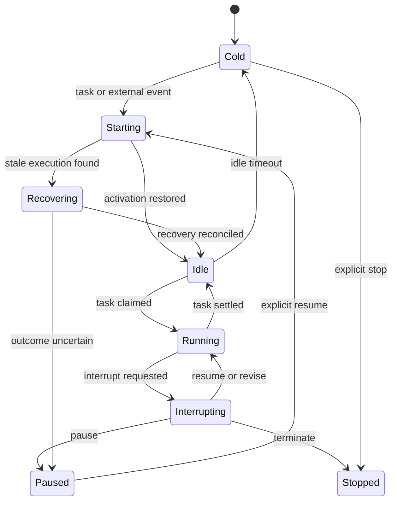

# Aureways 实施计划

> - 版本：0.1
> - 状态：V0.1 核心结构已实现，宿主注册与网络传输待完成
> - 目标形态：单一、可安装的 DeepSeek Harness（DSH）Cordis 插件
> - npm 包：`dsh-aureways`
> - Cordis 插件：`aureways`
> - Context 服务：`ctx.aureways`

## 1. 项目愿景

Aureways 为 DSH 增加 Persistent Agent 能力，使 Agent 不再只能作为某个前端会话或父 Agent 临时创建、任务结束后立即销毁的 Subagent，而是成为具备稳定身份、Goal、状态、工作空间、执行历史和恢复能力的长期实体。

Aureways 中长期存在的是 Agent 的身份与状态，而不是持续运行的模型调用或永不释放的 `AgentHandle`。DSH 进程负责承载插件；Agent 在没有工作时可以进入 cold 状态，在收到任务、外部事件或恢复请求时重新装载对应 Session。

目标特征：

- **Persistent**：Agent 身份、任务、Goal、检查点和执行历史可跨 DSH 重启保留。
- **Interruptible**：外部事件可以异步请求中断当前执行路径。
- **Resumable**：Agent 可以从持久 Session、检查点和外部任务状态重建上下文。
- **Harness-independent**：Claude Code、Codex、Gemini 或其他 Harness 只作为调用方，不拥有 Agent 生命周期。
- **Context-rot resistant**：依靠结构化状态、检查点、分层记忆和动态上下文重建，而不是无限累积对话。
- **Model-efficient**：Always-On 表示 Runtime 可随时响应，不表示 Agent 持续调用模型。

## 2. 产品边界

### 2.1 Aureways 是什么

Aureways 是一个加载到现有 DSH Profile 的插件包。插件通过 Cordis 生命周期注册服务、事件监听器、工具和可选协议入口。

安装形态：

```sh
dsh plugin --profile web add .
dsh --profile web --dump-config
dsh --profile web
```

插件的所有能力从同一个入口装载：

```text
apply(ctx, config)
  └── ctx.aureways
      ├── persistent agent directory
      ├── task queue
      ├── activation supervisor
      ├── interrupt controller
      ├── checkpoint coordinator
      ├── model-facing tools
      └── optional protocol adapters
```

## 3. 核心概念

### 3.1 Persistent Agent

长期存在的逻辑实体。拥有稳定的 `PersistentAgentId`、当前 Session、工作空间、配置、生命周期状态和版本号。

### 3.2 Agent Activation

Persistent Agent 在当前 DSH 进程中的活动实例，对应一个由 `ctx.agents.create()` 或 `ctx.agents.resume()` 返回的 `AgentHandle`。

Activation 可以被释放；Persistent Agent 不会因此消失。

### 3.3 Runtime Task

外部 Harness、当前 DSH Agent 或其他调用方提交的一次工作。Task 独立于 Session Turn，拥有自己的状态、优先级、幂等键和结果。

### 3.4 Agent Interrupt

对当前执行路径的持久控制请求。Interrupt 到达与 Interrupt 生效是两个不同阶段：请求可以随时到达，但只在明确安全点接管 Agent。

### 3.5 Checkpoint

能够重建执行状态的持久锚点。Checkpoint 引用 Session 序号、当前 Task、Goal 修订版本、工作空间修订和可选摘要，而不是复制完整上下文。

## 4. 总体架构



协议适配器和模型工具只能调用 `ctx.aureways`，不能直接持有 `AgentHandle`。这个约束保证客户端断开、工具调用结束或协议连接重建时不会意外销毁 Persistent Agent。

## 5. DSH 集成策略

### 5.1 复用现有能力

| DSH 能力 | Aureways 用途 |
|---|---|
| `ctx.agents.create()` | 创建第一次 Activation |
| `ctx.agents.resume()` | 从持久 Session 恢复 Activation |
| `Agent.followup()` | 提交普通后续任务输入 |
| `Agent.steer()` | 在下一 Step 安全点处理软中断 |
| `Agent.cancel(..., { keepInbox: true })` | 紧急中断当前活动并保留排队输入 |
| `Agent.whenIdle()` | 等待 Agent、工具和清理逻辑完全收敛 |
| `Agent.runMaintenance()` | 在真实 idle 阶段执行恢复和检查点维护 |
| `ctx.sessions.flush()` | 建立持久化屏障 |
| Session checkpoint policy | 模型请求和顶层工具副作用前的语义持久化 |
| `ctx.goals` | 当前 Session 内的 Goal 状态 |
| Compaction | 压缩工作记忆并保留最近上下文 |
| Session event log | 执行历史、重放、故障修复和审计 |

### 5.2 Aureways 自己负责的能力

- Persistent Agent 目录和稳定身份。
- cold/live Activation 映射。
- Runtime Task 状态和任务队列。
- Interrupt 请求、确认、决策和结算。
- Agent Lease 与并发准入。
- 跨重启恢复协调。
- Checkpoint 索引。
- 外部协议到 Aureways 服务的映射。

### 5.3 第一版 Core 兼容策略

V0.1 不修改 DSH Core。由于 `AgentCancelCause` 当前不是开放扩展类型，紧急中断暂时使用：

```ts
{
  kind: 'hook',
  reason: `aureways-interrupt:${interruptId}`,
}
```

后续如需向 DSH 上游贡献改动，再将 `aureways-interrupt` 设计为正式、可声明合并的取消原因。

## 6. 插件内部模块

插件保持单一 npm 包，内部按责任拆分：

```text
src/
├── index.ts                 # Cordis 入口、Config、公开导出
├── service.ts               # AurewaysService 公共 API
├── domain/
│   ├── ids.ts               # 品牌化 ID
│   ├── agent.ts             # Persistent Agent 类型与转换
│   ├── task.ts              # Runtime Task 类型与转换
│   ├── interrupt.ts         # Interrupt 类型与转换
│   └── checkpoint.ts        # Checkpoint 类型
├── store/
│   ├── contract.ts          # Store 接口
│   ├── sqlite.ts            # SQLite Provider
│   ├── migrations.ts        # 单调 schema version
│   └── projections.ts       # 事件到当前视图的折叠
├── runtime/
│   ├── supervisor.ts        # Activation 创建、恢复、休眠
│   ├── scheduler.ts         # Agent 内串行与跨 Agent 并行
│   ├── interrupt.ts         # 中断控制器
│   ├── checkpoint.ts        # 持久化屏障和恢复锚点
│   └── recovery.ts          # 启动时故障协调
├── context/
│   ├── identity.ts          # 稳定身份上下文
│   ├── rebuild.ts           # 动态上下文重建
│   └── memory.ts            # 分层记忆入口
├── tools/
│   └── index.ts             # 模型可调用管理工具
└── protocol/
    ├── a2a.ts               # 可选 A2A 适配器
    └── acp.ts               # 后续 ACP 适配器
```

内部拆分只用于解耦；对 DSH 来说仍是一个 `aureways` 插件和一个 `ctx.aureways` 服务。

## 7. 持久状态模型

### 7.1 Persistent Agent

```ts
interface PersistentAgentRecord {
  agentId: PersistentAgentId
  sessionId: SessionId
  state:
    | 'cold'
    | 'starting'
    | 'idle'
    | 'running'
    | 'interrupting'
    | 'recovering'
    | 'paused'
    | 'stopped'
    | 'error'
  cwd: string
  preset?: string
  revision: number
  createdAt: number
  updatedAt: number
}
```

`PersistentAgentId` 与 `SessionId` 必须分开。V0.1 可以保持一对一映射，但不能在公共 API 中假设两者永远相同。

### 7.2 Runtime Task

```ts
interface RuntimeTaskRecord {
  taskId: RuntimeTaskId
  agentId?: PersistentAgentId
  state:
    | 'submitted'
    | 'queued'
    | 'working'
    | 'input-required'
    | 'completed'
    | 'failed'
    | 'canceled'
    | 'outcome-unknown'
  priority: number
  input: JsonValue
  result?: JsonValue
  idempotencyKey?: string
  createdAt: number
  updatedAt: number
}
```

Persistent Agent 的前台 Task 必须串行执行。Ephemeral Task 可以在全局配置的并发上限内并行执行。

### 7.3 Agent Interrupt

```ts
interface AgentInterruptRecord {
  interruptId: InterruptId
  agentId: PersistentAgentId
  mode: 'soft' | 'urgent'
  state: 'requested' | 'acknowledged' | 'replanning' | 'resolved' | 'failed'
  priority: number
  payload: JsonValue
  decision?: 'resume' | 'revise' | 'pause' | 'terminate'
  idempotencyKey?: string
  requestedAt: number
  resolvedAt?: number
}
```

### 7.4 Checkpoint

```ts
interface AgentCheckpointRecord {
  checkpointId: CheckpointId
  agentId: PersistentAgentId
  sessionId: SessionId
  throughSeq: number
  reason: 'turn-end' | 'interrupt' | 'idle-unload' | 'shutdown' | 'periodic'
  taskId?: RuntimeTaskId
  goalId?: string
  goalRevision?: number
  workspaceRevision?: string
  summaryRef?: string
  createdAt: number
}
```

## 8. 生命周期状态机



状态转换必须使用 revision/CAS，避免多个调用方同时覆盖 Agent 状态。

## 9. Agent Interrupt 机制

### 9.1 基本原则

- Interrupt 请求可在任何时间持久化。
- Agent 不进行任意指令级抢占。
- 中断只在可验证安全点接管控制。
- 中断的到达、确认、Replan 和结算必须分别记录。
- 外部工具副作用不能因为中断而被盲目重放。

### 9.2 Soft Interrupt

适用于不会立即威胁当前执行正确性的新增信息：

1. 在 Aureways Store 持久化 `interrupt/requested`。
2. 将 Agent 状态更新为 `interrupting`。
3. 调用 `agent.steer()`，把中断内容放到最近的下一 Step。
4. 当前正在执行的工具自然完成。
5. Agent 进入 Replan，并产生决策。
6. 持久化 `interrupt/resolved`。

### 9.3 Urgent Interrupt

适用于当前路径必须尽快停止的外部变化：

1. 事务性持久化 Interrupt 请求。
2. 调用 `agent.cancel(cause, { keepInbox: true })`。
3. 等待 `agent.whenIdle()`，不得在模型或工具仍在退出时启动 Replan。
4. 调用 `ctx.sessions.flush(agent.session)`。
5. 写入 Interrupt Checkpoint。
6. 记录 `interrupt/acknowledged`。
7. 通过 `agent.followup()` 提交有日志记录的 Replan 输入。
8. Agent 通过内部决策工具返回 `resume | revise | pause | terminate`。
9. Runtime 执行决策并写入最终状态。

### 9.4 中断安全点

V0.1 支持以下安全点：

- Agent 已经 idle。
- `agent/pre-step` 之前。
- 当前工具结果已经记录之后。
- `agent/turn-stopping` 阶段。
- Urgent cancel 完全收敛并完成 Session flush 之后。

### 9.5 中断并发

- 每个 Agent 同时只处理一个 Interrupt。
- 未处理 Interrupt 按优先级和创建顺序排队。
- 相同 idempotency key 的重复请求返回原 Receipt。
- 更高优先级请求可以排在尚未 acknowledged 的低优先级请求之前。
- 已经进入 Replan 的 Interrupt 不再被静默替换。

## 10. Context rot 与动态重建

### 10.1 记忆层次

| 层 | 内容 | V0.1 |
|---|---|---|
| Identity | 名称、Persona、能力、权限、Workspace | 实现 |
| Working Memory | DSH Session Log 和最近对话 | 复用 |
| Structured State | Goal、Task、Interrupt、Checkpoint | 实现 |
| Episodic Memory | 经过来源标记的长期摘要 | 基础接口 |
| Semantic Memory | 向量索引和检索 | 延后 |
| Workspace Memory | 文件、Git 状态、产物引用 | 实现引用，不复制内容 |

### 10.2 恢复上下文

每次 cold → starting 或 crash recovery 时，按稳定顺序重建：

```text
Agent Identity
+ current Goal snapshot
+ current Runtime Task
+ latest Checkpoint
+ pending Interrupts
+ workspace revision and important artifacts
+ compacted Session history
```

进入模型请求的内容必须能够从 Session Log 或对应的已记录请求头重建。禁止只向进程内 Prompt 注入无法审计的隐藏状态。

### 10.3 Compaction 策略

- 继续使用 DSH Compaction 处理对话历史压力。
- Goal、Task 和 Interrupt 状态不依赖对话摘要作为唯一事实来源。
- Checkpoint 只引用经过持久化的结构化状态。
- Compaction 失败不得破坏当前 Session。
- 恢复时优先读取结构化状态，再读取摘要。

## 11. 存储设计

V0.1 使用独立 SQLite 文件，默认位置：

```text
.dsh/aureways/aureways.sqlite
```

不要与 DSH Session SQLite 共用 schema 所有权。两者通过 `PersistentAgentId`、`SessionId` 和 Session 序号关联。

建议表：

- `agents`
- `tasks`
- `interrupts`
- `checkpoints`
- `runtime_events`
- `agent_leases`
- `schema_meta`

约束：

- SQLite schema version 单调递增。
- 所有 ID 唯一且不可复用。
- Task 和 Interrupt 支持唯一 idempotency key。
- Agent 修改必须检查 revision。
- 状态转换与对应 Runtime Event 在同一事务中提交。
- 外部 JSON 在入库前完成 schema 校验和深拷贝。

## 12. Activation Supervisor

Supervisor 负责将 Persistent Agent 映射到 DSH live Agent：

### 12.1 创建

1. 验证工作空间和配置。
2. 创建 Persistent Agent 与初始 Session ID。
3. 通过 `ctx.agents.create()` 创建 Activation。
4. 在 `setup` 中注册 Agent-scoped Prompt、工具限制和 Interrupt 决策能力。
5. 发布 `idle` 状态。

### 12.2 恢复

1. 获取 Agent Lease。
2. 检查是否已有 live Activation。
3. 读取最新 Checkpoint 和结构化状态。
4. 通过 `ctx.agents.resume()` 恢复 Session。
5. 在 `setup` 中重新建立相同 Agent-scoped 能力。
6. 注入可持久重建的恢复上下文。
7. 发布 `idle` 或 `recovering` 状态。

### 12.3 冷却

1. Agent 必须 idle。
2. 不存在正在处理的 Interrupt。
3. Task 队列为空。
4. 写入 `idle-unload` Checkpoint。
5. Flush Session。
6. Dispose `AgentHandle`。
7. 释放 Lease，Agent 状态进入 `cold`。

## 13. Task 调度

### 13.1 Persistent Agent Task

- 每个 Persistent Agent 一个串行前台队列。
- 提交 Task 不要求 Agent 当前 live。
- cold Agent 收到 Task 后自动恢复。
- Task 开始前记录 `working`。
- Task 只在 Agent 回到真实 idle 且结果已提交后完成。

### 13.2 Ephemeral Task

- 不创建 Persistent Agent 目录记录。
- 每个 Task 创建独立 DSH Agent/Session。
- 可在全局并发限制内并行。
- Task 完成、失败或取消后 dispose Handle。
- 可选择保留 Session 工件用于审计，但不允许恢复为 Persistent Agent，除非经过显式 promote 操作；promote 延后设计。

## 14. 对外入口

### 14.1 DSH 模型工具

V0.1 注册：

- `aureways_agent_create`
- `aureways_agent_list`
- `aureways_agent_status`
- `aureways_agent_submit`
- `aureways_agent_interrupt`
- `aureways_agent_pause`
- `aureways_agent_resume`
- `aureways_agent_stop`

工具只调用 `ctx.aureways`，工具输出使用稳定 JSON 值和独立 renderer。

### 14.2 A2A Adapter

A2A 作为可选插件内部模块，不改变 Aureways Domain：

- A2A Task ID 映射 `RuntimeTaskId`。
- A2A Context ID 保持外部交互语义，不作为 `PersistentAgentId`。
- 目标 Agent ID 通过明确扩展字段传递。
- Task 查询、取消和订阅只读取 Aureways Task 状态。

### 14.3 ACP Adapter

ACP 放在 A2A 之后实现：

- 连接不拥有 Persistent Agent 生命周期。
- `session/prompt` 映射到 Runtime Task。
- `session/cancel` 取消当前 Task，不删除 Agent。
- 客户端断开只释放订阅和协议资源。

## 15. 配置

计划中的 V0.1 配置：

```ts
interface Config {
  dataDirectory: string
  idleUnloadMs: number
  maxLiveAgents: number
  maxEphemeralTasks: number
  checkpointEveryTurns: number
  interruptDecisionTimeoutMs: number
  recoveryPolicy: 'pause-on-uncertain' | 'replan-on-uncertain'
  enableTools: boolean
  enableA2A: boolean
  a2aHost: string
  a2aPort: number
}
```

任何两个部署可能希望采用不同值的参数都必须进入 Config，不能硬编码在实现中。

## 16. 故障与一致性边界

### 16.1 进程崩溃

启动恢复流程：

1. 扫描过期 Agent Lease。
2. 将残留 `running` 或 `interrupting` 记录转为 `recovering`。
3. 恢复 DSH Session，并接受其 interrupted-turn 修复。
4. 对没有确定结果的外部副作用标记 `outcome-unknown`。
5. 默认暂停或触发验证型 Replan，不自动重放副作用工具。

### 16.2 持久化失败

- Task/Interrupt 请求没有成功持久化时不得驱动 Agent。
- Session flush 失败时不得声明 Checkpoint 成功。
- Interrupt 已取消当前执行但 Checkpoint 失败时，Agent 进入 `paused/error`，不能继续原路径。

### 16.3 插件卸载

1. 停止新任务准入。
2. 取消定时器和协议监听。
3. 等待所有 Agent 收敛。
4. Flush live Sessions。
5. Dispose AgentHandles。
6. 释放 Lease 并关闭 Store。

## 17. 安全边界

V0.1 默认面向本机可信环境：

- A2A 默认关闭。
- 网络监听默认仅允许 loopback。
- Workspace 必须是规范化绝对路径。
- Persistent Agent 不自动扩大 DSH 沙箱和审批权限。
- 协议调用方不能通过可猜测 ID 绕过授权。
- Store 不保存明文模型密钥；凭证继续由 DSH Credentials 服务管理。
- 日志不得写入 API Key、Bearer Token 或完整秘密配置。

## 18. 实施里程碑

### M0：插件骨架

状态：已完成。

- [x] 创建 `dsh-aureways` 包。
- [x] 声明 `dsh.bundle`。
- [x] 注册 `ctx.aureways` 服务骨架。
- [x] 建立 TypeScript 严格配置。
- [x] 通过 build 和 typecheck。

### M1：领域模型与 SQLite Store

- [x] 品牌化 Agent、Task、Interrupt、Checkpoint ID。
- [x] 定义状态转换和错误码。
- [x] 实现 SQLite schema、WAL、FTS5 与迁移。
- [x] 实现 CAS revision 和 Task idempotency key。
- [x] 实现 Store contract tests。

验收：所有状态可在进程重启后准确读取；非法转换、重复 ID 和陈旧 revision 会明确失败。

### M2：Persistent Agent 生命周期

- [ ] 实现创建、读取、列举、暂停、恢复和停止。
- [x] 实现 Agent Lease。
- [x] 实现 `ctx.agents.create/resume` 的 DSH Activation Adapter。
- [x] 实现 idle unload 和 cold resume。
- [x] 实现插件卸载的 checkpoint、cold 与有序清理。

验收：同一 Agent 重启 DSH 后保留身份和 Session，并且任意时刻最多一个 live Activation。

### M3：Runtime Task

- [x] 实现每 Agent 串行队列。
- [x] 实现跨 Agent 并行。
- [ ] 实现 Ephemeral Task 并发限制。
- [x] 实现任务状态、取消和结果持久化。
- [x] 实现基础管理工具 descriptor/handler；DSH 工具注册待宿主装配。

验收：两个调用方向同一 Agent 并发提交时严格串行；不同 Agent 或 Ephemeral Task 可以按配置并行。

### M4：Interrupt 与 Replan

- [x] 实现 Soft Interrupt。
- [x] 实现 Urgent Interrupt。
- [ ] 实现 Interrupt 队列和幂等。
- [x] 实现 Session flush 与 Interrupt Checkpoint。
- [x] 实现可注入的 Replan 决策 Adapter；模型工具注册待宿主装配。
- [x] 实现 resume/revise/pause/terminate 决策。

验收：中断不会丢失排队 Task；Urgent Interrupt 只在 Agent 收敛和 Session 持久化后开始 Replan。

### M5：Context Reconstruction

- [ ] 注册 Agent Identity 上下文。
- [x] 实现 Task、Goal、Checkpoint、Interrupt 与长期记忆的动态 Context Bundle。
- [ ] 接入 DSH Compaction。
- [x] 记录 Workspace revision 和重要产物引用。
- [x] 实现 crash recovery 与不确定副作用暂停/核验。

验收：经过重启和至少一次 Compaction 后，Agent 仍能根据结构化状态继续原 Goal。

### M6：A2A Adapter

- [ ] 实现可选 loopback HTTP 监听。
- [x] 实现 transport-agnostic Task submit/get/list/cancel 映射；subscribe 待网络层。
- [ ] 发布 Agent capability 和 Aureways 扩展信息。
- [x] 协议连接不拥有 Agent/Task 生命周期，断线后状态继续持久化。

验收：客户端断开不会销毁 Agent 或 Task；重新连接后可查询并订阅原 Task。

### M7：ACP Adapter 与发布

- [x] 实现 ACP Prompt/Cancel 到 Task 的映射。
- [x] 验证协议连接不拥有 AgentHandle。
- [ ] 完成 package 安装、更新和卸载测试。
- [ ] 完成 README、配置和协议文档。
- [ ] 打包 npm/tarball 发布物。

## 19. 测试计划

### 19.1 单元测试

- 状态机合法与非法转换。
- ID、revision、幂等键。
- Interrupt 优先级和去重。
- Context 重建的稳定顺序。
- Config schema。

### 19.2 集成测试

- 使用真实 Cordis Context 装载插件。
- 使用 DSH Agent Registry 创建和恢复 Agent。
- Session flush 成功与失败。
- 插件 HMR/unload 的资源释放。
- SQLite 崩溃恢复与迁移。

### 19.3 关键场景

1. 创建 Agent、执行 Task、释放 Activation、重新恢复。
2. DSH 重启后使用同一 `PersistentAgentId` 继续工作。
3. 客户端断开后 Agent 和 Task 仍存在。
4. 同一 Agent 的多 Task 串行执行。
5. 多个 Ephemeral Task 并行执行并正确释放。
6. Soft Interrupt 在下一 Step 进入 Replan。
7. Urgent Interrupt 在 cancel、idle、flush 后进入 Replan。
8. 工具副作用期间崩溃后产生 `outcome-unknown`。
9. Compaction 后依据 Goal、Task 和 Checkpoint 恢复。
10. 两个 Runtime 实例不能同时获得同一 Agent Lease。

## 20. V0.1 完成定义

只有同时满足以下条件，Aureways V0.1 才算完成：

- 项目仍是单一 DSH 插件包，而不是独立 App。
- Persistent Agent 身份可跨 DSH 重启保留。
- Agent 可以 cold unload 和按需 resume。
- Runtime Task 有独立持久状态。
- 同一 Persistent Agent 的前台工作严格串行。
- Soft/Urgent Interrupt 均有完整持久生命周期。
- Urgent Interrupt 不会在未收敛的工具或模型请求上直接启动 Replan。
- 恢复逻辑不会盲目重放结果不确定的副作用。
- Context 重建不依赖无限对话历史。
- 插件卸载后不存在遗留 AgentHandle、定时器、数据库连接或协议监听。
- 构建、类型检查、单元测试、集成测试和安装 smoke test 全部通过。

## 21. 延后事项

- 多节点 Runtime 和分布式 Lease。
- Persistent Agent 跨节点迁移。
- 多个并行前台 Goal。
- Agent Session 自动轮换和归档。
- 完整向量语义记忆。
- Exactly-Once 通用副作用事务。
- 浏览器管理 UI。
- Ephemeral Agent 自动 promote。
- 完整 ACP/A2A 功能对等。

这些能力不得提前侵入 V0.1 的领域模型；V0.1 只需保留稳定扩展点。
